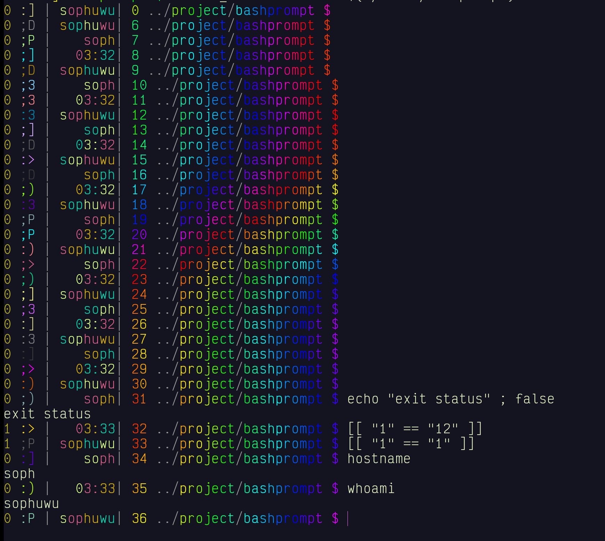

# Bash Prompt Generator

<center></center>

## Installation
```bash
make
./build/bashprompt help
# run the output to enable the prompt
```
Copy the output to your .bashrc for automatic start up. **DO NOT** USE .bash_profile or .profile.

